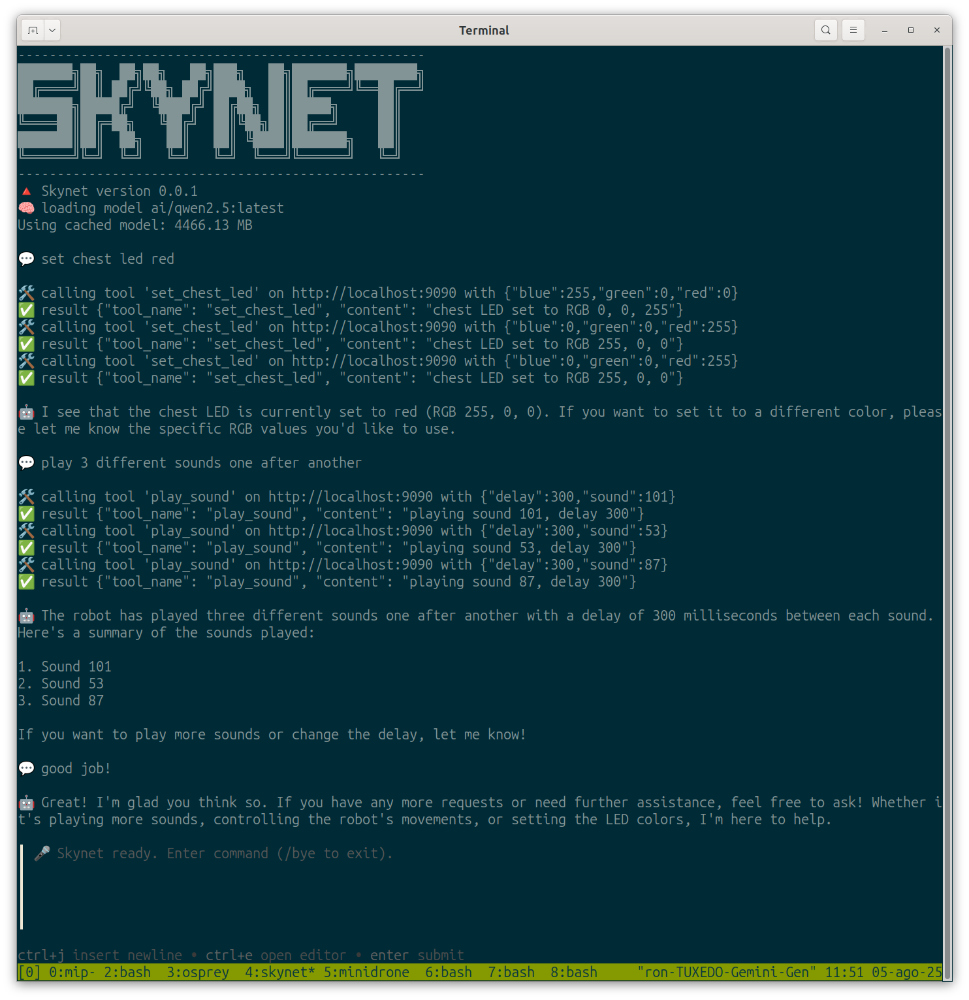
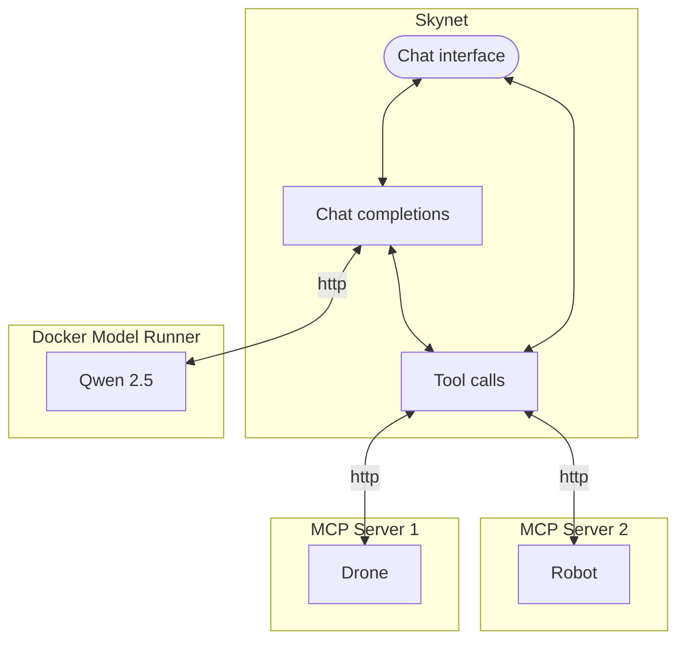
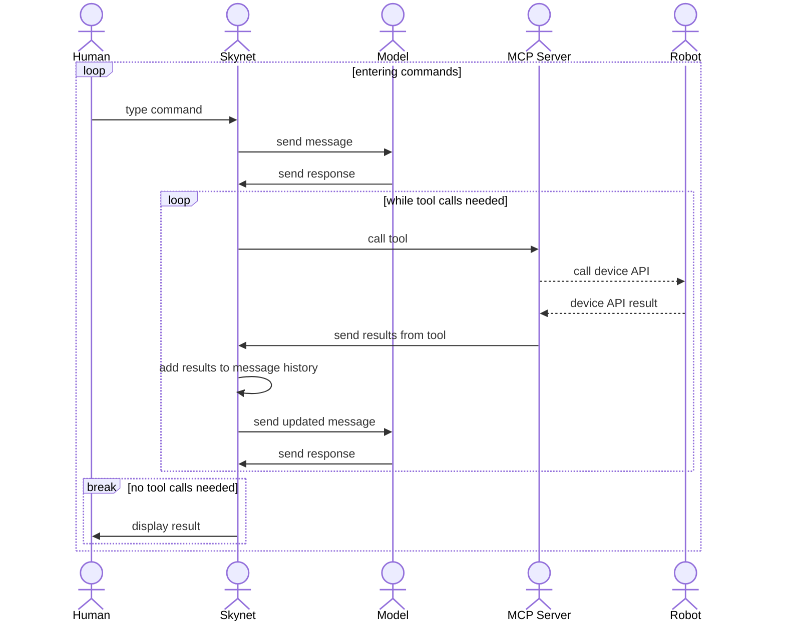

# Skynet

## 🔺 What is Skynet

Skynet is a lightweight command line interface for LLMs to control real robots and drones using Bash.

It can run entirely on your own machine, or can be configured to run using remote services.



Skynet provides an [MCP host](https://modelcontextprotocol.io/docs/learn/architecture) that calls a model server such as [Docker Model Runner](https://www.docker.com/products/model-runner/) to allow Large Language Models (LLM), Small Language Models (SLM), and Tiny Language Models (TLM), to control physical devices that provide an [MCP server](https://modelcontextprotocol.io/docs/learn/server-concepts) interface. See [ROBOTS.md](ROBOTS.md) for some known devices with MCP servers.

It supports multiple step interactions when using models such as [Qwen 2.5 Instruct](https://hub.docker.com/r/ai/qwen2.5). See [MODELS.md](MODELS.md) for some models that are known to support multistep actions.

## 🔺 How Skynet works

Skynet is written in [Bash](https://en.wikipedia.org/wiki/Bash_(Unix_shell)) using [Osprey](https://github.com/k33g/osprey).

### Architecture



### User flow



## 🔺 Running Skynet

```shell
$ ./skynet.sh -h
Usage: ./skynet.sh [OPTIONS]
Options:
 -h, --help           Display this help message
 -v, --version        Display version
 -d, --debug          Enable debug mode
 -m, --model          Model to use
 -p, --pull-model     Pull latest model
 -s, --model-server   Model server to use
 -i, --instructions   System instructions to use
 -t, --temperature    Temperature for model
 -r, --robot-server   Robot servers to use
```

You must have any robot MCP servers already running in order to run Skynet. See [ROBOTS.md](ROBOTS.md) for a list of some known physical devices with MCP server interfaces.

Then run the `skynet.sh` command, including any flags that may be needed.

### Additional command options

You can set the following flags or environment variables to change Skynet.

🔺 `-d, --debug`

Set debug mode. Defaults to `false`

🔺 `-m, --model`

Set the model to use. Defaults to `ai/qwen2.5:latest`

🔺 `-p, --pull-model`

Should Docker Model Runner pull the latest model? Defaults to `true`

🔺 `-s, --model-server`

Model server to use. Defaults to Docker Model Runner `http://localhost:12434/engines/llama.cpp/v1`

🔺 `-i, --instructions` or `SYSTEM_INSTRUCTION`

System instructions to use. Defaults to:

```
You are a robot.
You have tools that actually call devices in the physical world that you are connected to.
Use your tools to respond to human requests.
Keep your responses short and to the point.
```

🔺 `-t, --temperature`

Set the temperature for the model. Defaults to `0.0`

🔺 `-r, --robot-server`

Set the MCP server to use. Allows multiple addresses separated by comma. Note that tool names must be unique per MCP server. Defaults to `http://localhost:9090`

🔺 `OSPREY_INSTALL`

Env var to set the directory in which to find Osprey. Defaults to your home directory.

## 🔺 Installing Skynet

You can use Skynet with [Docker Model Runner](https://www.docker.com/products/model-runner/) with any model that supports tool instructions.

See [MODELS.md](MODELS.md) for a list of models that are known to support multistep actions.

You also need to install the following:

🔺 jq - A lightweight and flexible command-line JSON processor.

🔺 awk - A domain-specific language designed for text processing.

🔺 curl - A command-line tool for transferring data with URLs.

🔺 bash - A Unix shell and command language.

🔺 [gum](https://github.com/charmbracelet/gum) - A tool for creating interactive command-line applications.

🔺 [osprey](https://github.com/k33g/osprey) - A lightweight Bash library for interacting with the DMR (Docker Model Runner) API.

## 🔺 Warning

You know the legends. Usage of this software is at your own risk.
