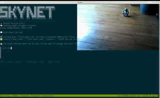
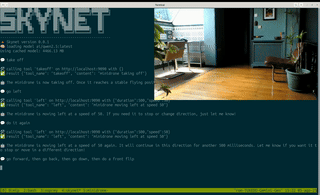

# 🔺 Robots

These are some known MCP servers to robotic devices.

## 🔺 MiP

[MiP - WowWee MiP Robot](https://github.com/hybridgroup/tinygo-mip/tree/main/cmd/mcp-mip)

[Video](https://youtu.be/pjdVFTTeT2A)

## 🔺 Minidrone

[Minidrone - Parrot Minidrone](https://github.com/hybridgroup/tinygo-minidrone/tree/main/cmd/mcp-minidrone)

[Video](https://youtu.be/8s6IWYfMqhE)
